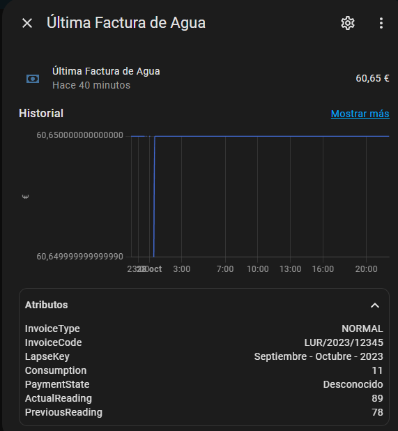
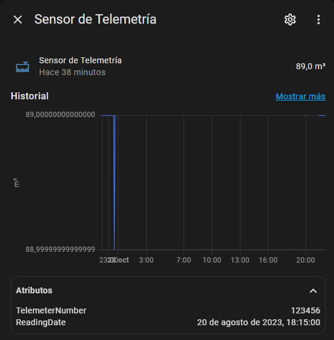

# Water Invoice and Telemetry Sensor Integration for Home Assistant

Este proyecto proporciona una integración para Home Assistant que permite obtener y mostrar datos de la última factura de agua y los datos de telemetría de consumo de agua a través de la API de Acciona.

## Características

- Obtención de la última factura de agua con detalles como el monto, el tipo de factura, el estado de pago, y los datos de consumo.
- Consulta de los datos de telemetría, incluyendo el número del medidor y la lectura actual de consumo.
- Configuración de un intervalo de actualización personalizado para minimizar el uso de la API.

## Requisitos

- Home Assistant instalado y configurado.
- API de Acciona para acceder a los datos de facturación y telemetría.

## Instalación

1. Clona este repositorio en tu instalación de Home Assistant.
2. Copia los archivos de la integración en la carpeta `custom_components` de Home Assistant.
3. Agrega la configuración en `configuration.yaml` para habilitar la integración (ver Configuración).

## Configuración

Añade la siguiente configuración en tu archivo `configuration.yaml`:

```yaml
sensor:
  - platform: water_invoice
    username: "TU_USERNAME"  # Tu nombre de usuario en formato BASE64
    password: "TU_PASSWORD"  # Tu contraseña en formato BASE64
    deviceToken: "TU_DEVICE_TOKEN"  # Token del dispositivo, obtenido desde el panel en https://clientesagua.acciona.com/ al iniciar sesión
    client_code: "TU_CODIGO_CLIENTE"  # Código de cliente proporcionado por Acciona
    contract_reference: "TU_REFERENCIA_CONTRATO"  # Referencia de contrato proporcionada por Acciona
    update_interval_hours: 24  # Intervalo de actualización en horas; opcional, el valor predeterminado es 24 horas

```
## Opciones de Configuración

- **username**: Usuario para acceder a la API de Acciona.
- **password**: Contraseña de acceso a la API.
- **deviceToken**: Token de dispositivo, requerido para la autenticación.
- **client_code**: Código del cliente de Acciona.
- **contract_reference**: Referencia del contrato de Acciona.
- **update_interval_hours**: Intervalo de actualización en horas (opcional, predeterminado a 24 horas).

## Entidades Disponibles

### Sensor de Factura de Agua
- **Nombre**: Última Factura de Agua
- **Unidad**: Euros (€)
- **Atributos**:
  - **invoiceType**: Tipo de factura.
  - **invoiceCode**: Código de la factura.
  - **lapseKey**: Período de facturación.
  - **consumption**: Consumo registrado en la factura.
  - **paymentState**: Estado de pago.
  - **actualReading**: Lectura actual del medidor.
  - **previousReading**: Lectura previa del medidor.

### Sensor de Telemetría
- **Nombre**: Sensor de Telemetría
- **Unidad**: Metros cúbicos (m³)
- **Atributos**:
  - **telemeterNumber**: Número del telemetro.
  - **readingDate**: Fecha de la última lectura.
## Vista Previa de la Integración

### Sensor de Factura de Agua


### Sensor de Telemetría


## Ejemplo de Uso

Esta integración permite ver en el tablero de Home Assistant los datos de tu factura y consumo de agua, los cuales se pueden usar para monitoreo y automación.

## Notas

Asegúrate de no exceder la cantidad de llamadas a la API. Es recomendable ajustar el intervalo de actualización en la configuración para evitar problemas de acceso.

## Licencia

Este proyecto está licenciado bajo la [Licencia Apache 2.0](LICENSE).